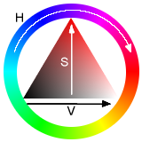

# Um analizador de imagens termográficas!

## Como funciona? É bem simples.

- Abra o TermoCrivo
- Adicione as imagens
- Veja o Resultado

# Padrão de leitura de cor:

### H: Hue (Matiz)
### S: Saturation (Saturação)
### V: Value (Valor)

# Tecnologias Utilizadas:
### Python
### OpenCV
### TKinter
